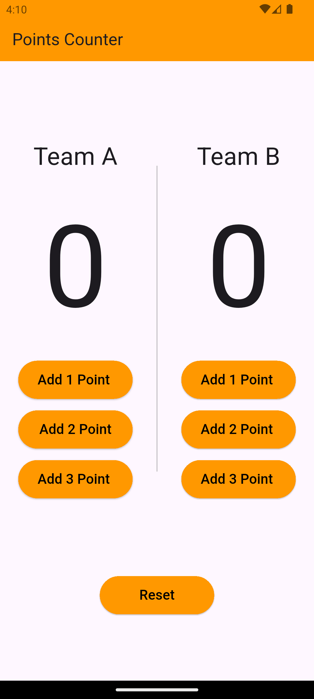

# 🏀 Basketball Counter App

A simple Flutter app to keep track of points for two basketball teams (Team A and Team B).  
Built using the BLoC pattern for state management.

## ✨ Features

- Add 1, 2, or 3 points to either team.
- Reset all scores with a single button.
- Organized using basic BLoC and Cubit architecture.

## 📂 Project Structure

```
lib/
├── cubit/
│   ├── counter_cubit.dart
│   └── counter_state.dart
├── views/
│   └── home_page.dart
└── main.dart
```

## 🚀 Getting Started

### Prerequisites

Make sure you have Flutter installed. If not, follow the [Flutter installation guide](https://docs.flutter.dev/get-started/install).

### Run the App

```bash
git clone https://github.com/Islamzaki10/basketball_counter_app.git
cd basketball_counter_app
flutter pub get
flutter run
```

## 📸 Screenshots




## 🧠 State Management

This app uses the `flutter_bloc` package to manage state:

- `CounterCubit` handles the logic for updating and resetting points.
- `CounterState` defines the possible states of the UI.

## 🧑‍💻 Author

**Islam Zaki**  
GitHub: [@Islamzaki10](https://github.com/Islamzaki10)

## 📄 License

This project is open source and free to use under the [MIT License](https://opensource.org/licenses/MIT).